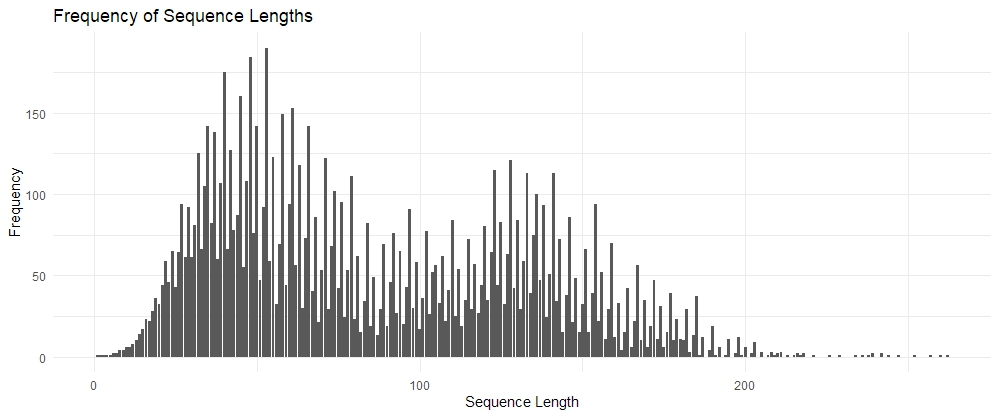

# Assignment 1 (R group)

> Analysis of the Collatz Conjecture

- [Assignment questions](ASSIGNMENT.md) 
- Please also read [`INSTRUCTIONS.md`](INSTRUCTIONS.md) for specific
submission instructions and marking rubric.

# Table of Contents
- [Background](#Background)
- [Tasks](#Tasks)
    1. [Generating the *Collatz Conjecture*](#1-generating-the-collatz-conjecture)
    2. [Exploratory Data Analysis](#2-exploratory-data-analysis)
    3. [Investigating "backtracking" in sequences](#3-investigating-backtracking-in-sequences)
    4. [Visualisations](#4-visualisations)
    5. [Open-ended exploration - Frequency of Prime Numbers](#5-open-ended-exploration---frequency-of-prime-numbers)
    6. [Creative visualisation challenge](#6-creative-visualisation-challenge)
        1. [Visualising Prime Counts in *Collatz Conjecture*](#61-visualising-prime-counts-in-collatz-conjecture)
        2. [Visualising Frequency of Sequence Lengths](#62-visualising-frequency-of-sequence-lengths)
- [Contribution declaration](#contribution-declaration)

## Background

The Collatz Conjecture is a mathematical conjecture concerning a sequence defined as follows. Start with any positive integer $n$. Then each term is obtained from the previous term according to these rules:

1. If the previous term is even, the next term is one half of the previous term.
2. If the previous term is odd, the next term is $3$ times the previous term plus $1$.

The conjecture is that no matter what value of $n$, the sequence will always reach 1.

## Tasks

### 1) Generating the *Collatz Conjecture*

In this task, we implemented a solution to the *Collatz Conjecture*, which involves generating the *Collatz* sequence for positive integers. We created an R function called `gen_collatz` that generates the sequence, and then applied this function to integers from $1$ to $10,000$, storing the results in a tibble. The tibble, named `collatz_df`, contains the starting integer values and their corresponding *Collatz* sequences.

**Outcome:**

- Implemented the `gen_collatz` function to generate *Collatz* sequences.
- Applied the function to a range of positive integers from $1$ to $10,000$.
Stored the results in a tibble (`collatz_df`) with columns for starting values and *Collatz* sequences.
- This analysis provides a clear understanding of how the *Collatz Conjecture* was approached and what the resulting data structure contains.

### 2) Exploratory Data Analysis

In this task, we conducted exploratory data analysis on the Collatz sequences generated in Task 1. The analysis involved answering several questions using `{tidyverse}` data wrangling techniques.

**Question 1: Find the top 10 starting integers that produce the longest sequences**

To answer this question, we sorted the `collatz_df` tibble in descending order of sequence length and selected the top 10 rows. These rows represent the starting integers that produce the longest Collatz sequences.

**Question 2: Find out which starting integer produces a sequence that reaches the highest maximum value**

For this question, we searched for the starting integer that results in the highest maximum value within its sequence. This allows us to identify the integer that produces the most significant maximum value.

**Question 3: What is the average length and standard deviation of the sequence for even starting integers compared to odd ones?**

To answer this question, we calculated the average length and standard deviation of sequences separately for even and odd starting integers. This analysis helps us understand the distribution of sequence lengths between these two categories.

Below are the variables we made use of for answering the questions:

- `top10longest` is to find the top 10 starting integers in the longest Collatz sequences.

- `max_val_int` is the starting integer with highest maximum value in a Collatz sequence.

- `even_odd_summary` is the summary statistics for even and odd starting integers, consisting the average length and standard deviation for each group.

Extractions of the individual average length and standard deviation values for even and odd starting integers:

- `even_odd_avg_len` keep the average length for even and odd starting integers.

- `even_odd_sd_len` keep the standard deviation for even and odd starting integers.

**Outcome:**

- Identified the top 10 starting integers with the longest sequences.
- Determined the starting integer with the highest maximum value in its sequence.
- Calculated the average length and standard deviation of Collatz sequences for even and odd starting integers.

### 3) Investigating "backtracking" in sequences

"Backtracking" occurs when a sequence reaches a value that is less than the starting integer, but then increases again above the starting integer at least once before reaching 1. We were tasked to explore the concept of “backtracking” within the *Collatz Conjecture*.

**Outcome:**

- A function `backtracking_stats` was made which uses a sequence and its starting value to determine whether the sequence backtracks, the number of times the sequence goes above their starting integer (`above_count`), and the maximum value reached after the first backtrack for the sequence (`max_after_backtrack`). The function then prints the information in the order above.
- A new data frame, `backtracks_df`, (based on the initial `collatz_df` data frame) is made. `backtracks_df` contains only backtracking sequences, and now includes the additional information from the `backtracking_stats` function.
- `mode_backtrack` provides information about the most frequently occurring number of times they go above their starting integer[^1].
- `even_odd_backtrack` gives the frequency counts of even and odd backtracking integers, in that order.

[^1]: This part of the task utilizes a statistical mode function by Ken Williams found [here](https://stackoverflow.com/questions/2547402/how-to-find-the-statistical-mode).

### 4) Visualisations

In this task, we utilized the `{ggplot2}` library to create appropriate visualizations that represent the data wrangling tasks previously performed.

**Part (1)** Scatterplot of Sequence Lengths

**Part (2)** Scatterplot of Highest Sequence Values

**Part (3)** Boxplot Comparing Sequence Lengths Distributions

**Question : Are there any noticeable differences?**

- Through these boxplots, we may observe that the *odd numbers* have generated *longer sequences* than *even numbers*.
- Also, *outliers* may be observed just beyond the maximum value of the *odd parity boxplot* while there exists *none* within the extremes of the *even boxplot*.

### 5) Open-ended exploration - Frequency of Prime Numbers

We conducted an open-ended exploration of the data, focusing on the frequency of prime numbers within Collatz sequences. The primary goal was to identify the prime numbers that appear most frequently in the sequences.

**Implementation:**

- The list of all sequences with starting integers from $1$ to $10000$ were taken and flattened.
- The frequencies of each occurring number were found and filtered to only include prime numbers (excluding 2).

**Outcome:**

The following result is produced, showing the top 10 most frequently occurring prime numbers:
|Prime Number|Frequency|
|:-----:|:-----:|
|5|9400|
|53|4693|
|13|4633|
|17|4489|
|23|4483|
|11|4310|
|61|4216|
|433|4148|
|577|4133|
|1367|4003|

**Some Observations:**

- Although $2$ occurs in all sequences (except for when the starting integer is $1$) and $5$ occurs in 94% of sequences, $3$ only occurs 12 times.
- The most frequently occurring

1 digit prime after $2$ and $5$ is $7$ occurring 1848 times;

2 digit prime is $53$ occurring 4693 times;

3 digit prime is $433$ occurring 4148 times;

4 digit prime is $1367$ occurring 4003 times;

5 digit prime is $29524$ occurring 268 times.

### 6) Creative visualisation challenge 

#### 6.1) Visualising Prime Counts in *Collatz Conjecture*

We aimed to visualize the frequency of prime numbers within *Collatz* sequences for integers ranging from $1$ to $10,000$. The process involved calculating the count of prime numbers in each sequence and creating a bar chart to represent this data.

**Implementation:**

- We utilized the `{primes}` package to efficiently check for prime numbers within the sequences.
- A vector, `prime_counts`, was created to store the count of prime numbers for each starting integer.
- A loop iterated through integers from $1$ to $10,000$, generating the *Collatz* sequence for each and counting the prime numbers.
- The resulting prime counts were stored in the `prime_counts` vector.

**Visualisation:**

- We employed the `{ggplot2}` library to create a bar chart (`collatz_prime_plot`) that displays the prime counts for each starting integer.
- The x-axis represents the starting integers, ranging from $1$ to $10,000$, while the y-axis represents the count of prime numbers within the *Collatz* sequences.
- A minimalistic theme was applied to the plot for clarity.

**Legend Addition:**

To enhance the interpretation of the plot, we added a legend-like information section below the title. This section displays the maximum prime count, minimum prime count, and average prime count among all starting integers.

**Outcome:**

- Generated a visualization that visually represents the distribution of prime numbers within *Collatz* sequences.
- The legend addition provides key statistics, including the maximum, minimum, and average prime counts, aiding in the interpretation of the plot and providing insights into the distribution of prime numbers within the sequences.

#### 6.2) Visualising Frequency of Sequence Lengths

We also aimed to visualise the frequency of *Collatz* sequence lengths generated for integers ranging from $1$ to $10,000$. The objective was to identify and visualise how often each sequence length occurs. Initially, we wanted to visualise this for unique sequences, but discovered that all sequences were unique.

**Implementation:**

- Subset the `length` column from `collatz_df`
- Created a bar plot visualising the frequency of sequence lengths. The x-axis represented sequence lengths, and the y-axis represented frequency.

**Outcome:**

- Identified *Collatz* sequence lengths counts.
- Represented the distribution of *Collatz* sequence lengths and their frequencies.

#### Contribution declaration

- Task 1: @nhfizhn
- Task 2: @jadotj
- Task 3: @nichongy
- Task 4: @AzharAmiin
- Task 5: @nichongy
- Task 6: @nhfizhn, @jadotj
- README: @nhfizhn, @jadotj, @nichongy, @AzharAmiin
